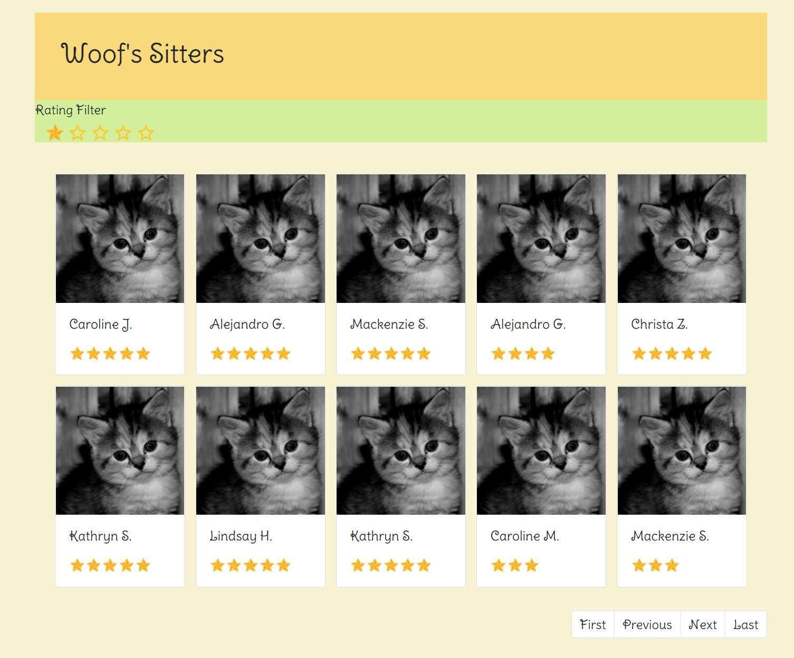

# Woof's Demo Project

## Description

I have built a simple RESTful web application for this project, using Java and Spring Boot. Data is persisted in-memory using H2. For front-end, I used javascript along with some CSS, jQuery and Bootstrap.

Once the application starts, I loaded all the data from the csv file to H2. 


## Design
There are the data access layer, the service layer and the web layer. I am using 3 entities - Owner, Sitter and Stay. Owner and Stay have one to many relationship, owner_id is the foreign key. Sitter and Stay have one to many relationship as well, sitter_id is the foreign key. 

The calculation of a sitter's score, average stay rating and rank are handled by SitterGradingService. When a stay is created, sitter's average stay rating and rank will be updated accordingly. When there is a name change with a sitter, his/her sitter score and rank will be re-calculated.


## Dev Environment

I used Eclipse as my IDE, and have Java 1.8.0_161 and Maven 3.5.2 installed on my Windows 10.


## Starting the Service

To start the service, in command prompt, cd to the project's root directory where the Maven files and the POM file are, then run

```
mvn spring-boot:run
```

## Webpage

Once the service has started, go to localhost:8080/sitters.html, the 5 stars on the top are clickable and they are the rating filter: 1 star is the min and the default for the page, it shows all sitters; 2 stars shows sitters with rating 2 or above, etc. The listing is already sorted by rank desc. Pagination is at bottom right.




## REST APIs
### Sitters

GET
```
http://localhost:8080/sitters?id={id}
```

POST
```
http://localhost:8080/sitters
```
```
    {
        "name": "Ilka A."
        "email": "user9866@gmail.com",
        "phone": "+19667334049",
        "imageUrl": "http://placekitten.com/g/500/500?user=53"
    }
```

PUT
```
http://localhost:8080/sitters?id={id}
```
```
    {
        "id": 506,
        "name": "Ilka B."
        "email": "new-email@gmail.com",
        "phone": "+19667334049",
        "imageUrl": "http://placekitten.com/g/500/500?user=53"
    }
```


DELETE
```
http://localhost:8080/sitters?id={id}
```

### Owners

GET
```
http://localhost:8080/owners?id={id}
```

POST
```
http://localhost:8080/owners
```
```
    {
        "name": "Nancy L.",
        "phone": "+11826582052",
        "email": "user3444@t-mobile.com"
    }
```

PUT
```
http://localhost:8080/owners?id={id}
```
```
    {
        "id": 2,
        "dogs": "yoyo",
        "imageUrl": "http://placekitten.com/g/500/500?user=155"
    }
```


DELETE
```
http://localhost:8080/owners?id={id}
```

### Stays

GET
```
http://localhost:8080/stays?id={id}
```

POST
```
http://localhost:8080/stays
```
```
    {
        "startDate": "2013-02-26",
        "endDate": "2013-04-08",
        "sitter": {
            "id": 1501,
            "name": "TIna Fla",
            "email": "tina.fla@gmail.com",
            "phone": "+19667334041",
            "imageUrl": "http://placekitten.com/g/500/500?user=1",
            "score": 1.15,
            "avgRating": 0,
            "rank": 1.15
        },
        "owner": {
            "id": 1502,
            "name": "Nancy Ella",
            "phone": "+11826582000",
            "email": "user3444@live.com",
            "dogs": null,
            "imageUrl": "http://placekitten.com/g/500/500?user=155"
        },
        "dogs": "Pinot Grigio",
        "rating": 5,
        "review": "Donec lacus justo luctus tellus nisl penatibus mus massa ipsum odio."
    }
```

PUT
```
http://localhost:8080/stays?id={id}
```
```
    {  
        "id": 1503,
        "startDate": "2013-02-26",
        "endDate": "2013-04-08",
        "sitter": {
            "id": 1501,
            "name": "TIna Fla",
            "email": "tina.fla@gmail.com",
            "phone": "+19667334041",
            "imageUrl": "http://placekitten.com/g/500/500?user=1",
            "score": 1.15,
            "avgRating": 0,
            "rank": 1.15
        },
        "owner": {
            "id": 1502,
            "name": "Nancy Ella",
            "phone": "+11826582000",
            "email": "user3444@live.com",
            "dogs": null,
            "imageUrl": "http://placekitten.com/g/500/500?user=155"
        },
        "dogs": "Plato",
        "rating": 5,
        "review": "Good stay"
    }
```


DELETE
```
http://localhost:8080/stays?id={id}
```


### Sitters Queries

#### Example
GET
Request:
```
http://localhost:8080/sitters?page=0&minrating=5
```

Response:
```
{
	"content": [
	  {
		"id": 950,
		"name": "Caroline J.",
		"email": "user6094@gmail.com",
		"phone": "+16222742157",
		"imageUrl": "http://placekitten.com/g/500/500?user=275",
		"score": 1.73,
		"avgRating": 5,
		"rank": 2.06
		},
	  {
		"id": 644,
		"name": "Mackenzie S.",
		"email": "user4917@t-mobile.com",
		"phone": "+12800700943",
		"imageUrl": "http://placekitten.com/g/500/500?user=166",
		"score": 1.73,
		"avgRating": 5,
		"rank": 2.06
		},
	  {
		"id": 603,
		"name": "Alejandro G.",
		"email": "user9414@gmail.com",
		"phone": "+11902228094",
		"imageUrl": "http://placekitten.com/g/500/500?user=54",
		"score": 1.73,
		"avgRating": 5,
		"rank": 2.06
		},
	  {
		"id": 706,
		"name": "Christa Z.",
		"email": "user7861@yahoo.com",
		"phone": "+12171301949",
		"imageUrl": "http://placekitten.com/g/500/500?user=254",
		"score": 1.54,
		"avgRating": 5,
		"rank": 1.89
		},
	  {
		"id": 620,
		"name": "Kathryn S.",
		"email": "user4691@hotmail.com",
		"phone": "+12123547633",
		"imageUrl": "http://placekitten.com/g/500/500?user=293",
		"score": 1.54,
		"avgRating": 5,
		"rank": 1.89
		},
	  {
		"id": 554,
		"name": "Kathryn S.",
		"email": "user4691@hotmail.com",
		"phone": "+12123547633",
		"imageUrl": "http://placekitten.com/g/500/500?user=293",
		"score": 1.54,
		"avgRating": 5,
		"rank": 1.89
		},
	  {
		"id": 586,
		"name": "Lindsay H.",
		"email": "user5322@t-mobile.com",
		"phone": "+13251142183",
		"imageUrl": "http://placekitten.com/g/500/500?user=217",
		"score": 1.54,
		"avgRating": 5,
		"rank": 1.89
		},
	  {
		"id": 974,
		"name": "Jennifer W.",
		"email": "user7759@hotmail.com",
		"phone": "+12835279898",
		"imageUrl": "http://placekitten.com/g/500/500?user=310",
		"score": 1.35,
		"avgRating": 5,
		"rank": 1.72
		},
	  {
		"id": 814,
		"name": "Ashley K.",
		"email": "user6178@hotmail.com",
		"phone": "+16126040040",
		"imageUrl": "http://placekitten.com/g/500/500?user=219",
		"score": 1.35,
		"avgRating": 5,
		"rank": 1.72
		},
	  {
		"id": 622,
		"name": "Chasen T.",
		"email": "user6379@t-mobile.com",
		"phone": "+19641764575",
		"imageUrl": "http://placekitten.com/g/500/500?user=237",
		"score": 1.35,
		"avgRating": 5,
		"rank": 1.72
		}
	],
	"pageable": {
		"sort": {
			"sorted": true,
			"unsorted": false
		},
		"offset": 0,
		"pageNumber": 0,
		"pageSize": 10,
		"unpaged": false,
		"paged": true
	},
	"last": false,
	"totalElements": 99,
	"totalPages": 10,
	"size": 10,
	"number": 0,
	"sort": {
		"sorted": true,
		"unsorted": false
	},
	"numberOfElements": 10,
	"first": true
}
```


## Running the tests

### Unit Tests
Unit Tests are located in files ended in "Test.java", such as "SitterServiceImplTest.java". 
To run the tests, in command prompt, cd to the project's root directory, then run

```
mvn clean test
```

### Integration Tests
Unit Tests are located in files ended in "IT.java", such as "OwnerControllerIT.java".
To run the tests, in command prompt, cd to the project's root directory, then run

```
mvn clean test-compile failsafe:integration-test
```

## Bugs
* I made a big mistake not seeing there are same sitters across stays (which I believed should be the case but I was careless when I went through the csv). Currently, the same sitter will appear more than once in the Sitter table with different ids. To fix it, I will do some data manipulation before I load them into the database.

* I think there's an issue when we try to update a stay - it should update sitter's avg rating and rank but the HTTP response body does not seem to show that. I need to look into where the problem comes from.

* Loading of the sitter data in the UI is not smooth at all. Being more of a backend developer, I will need to research what's the best practice of loading search results.


## To-Do
* If I have more time, I will add many more test cases. Code coverage should be 100%. I tried to come up with the most important tests, and spread them across unit tests and integration tests. Right now, the collection of tests are really insufficient.

* The REST APIs currently are very fundamental. There needs to be more validation and better error handling and presentation. 


## Notes
* I have some screenshots which show the REST API calls saved in the projects's root directory inside folder "screenshots".

